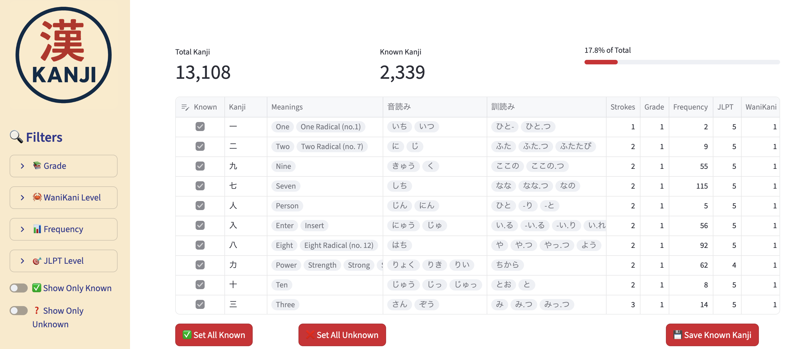

# Kanji Filter App

A web-based interactive tool for tracking and managing your Japanese kanji knowledge. Built with [Streamlit](https://streamlit.io/) and Python, this app allows users to filter, track, and update their known kanji efficiently.

---

## Features

-   📊 **Filter Kanji** by grade, JLPT level, frequency, and WaniKani level
-   ✅ **Mark Known/Unknown** kanji directly in an interactive table
-   💾 **Save Progress** to a JSON file for persistence
-   🎯 **Progress Tracking** with live metrics and progress bar
-   🖥 **Responsive Layout** adapts to browser size

---

## Demo



---

## Installation

1. Clone the repository:

```bash
git clone https://github.com/your-username/kanji-filter-app.git
cd kanji-filter-app
```

2. Create and activate a virtual environment (recommended):

```bash
python3 -m venv venv
source venv/bin/activate  # macOS/Linux
.venv\Scripts\activate    # Windows
```

3. Install dependencies:

```bash
pip install -r requirements.txt
```

## Usage

Run the app locally with Streamlit:

```bash
streamlit run app.py
```

The app will open in your default web browser. Use the sidebar filters to refine the kanji list and interact with the table to mark known kanji.

## Project Structure

```bash
kanji-filter-app/
│
├─ app.py                 # Main Streamlit app
├─ data/
│   ├─ kanji.json         # Kanji dataset
│   └─ known_kanji.json   # User known kanji progress
├─ images/
│   ├─ example.png        # Screenshot of example usage
│   └─ logo.png           # App logo image
├─ utils/
│   ├─ styling.py         # CSS styles
│   └─ data.py            # Kanji data loading functions
├─ requirements.txt       # Python dependencies
└─ README.md
```

---

## License

This project is licensed under the terms of the MIT [License](LICENSE).
You are free to use, modify, and distribute this project with attribution.

---

## Acknowledgments

Kanji data used is from [David Gouveia](https://github.com/davidluzgouveia)'s [Kanji Data Repository](https://github.com/davidluzgouveia/kanji-data).

Built using [Streamlit](https://streamlit.io/) for rapid interactive development.
